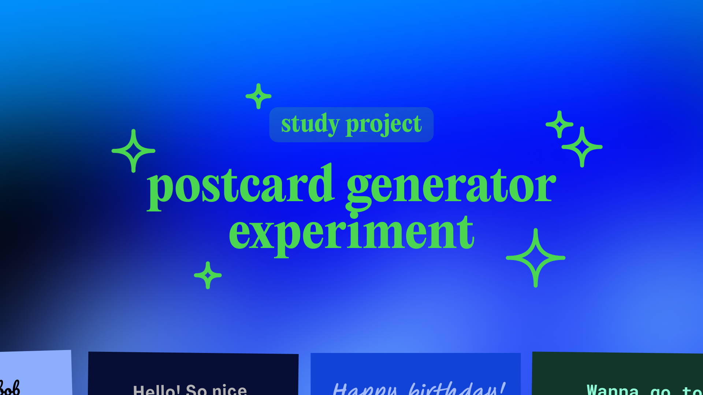
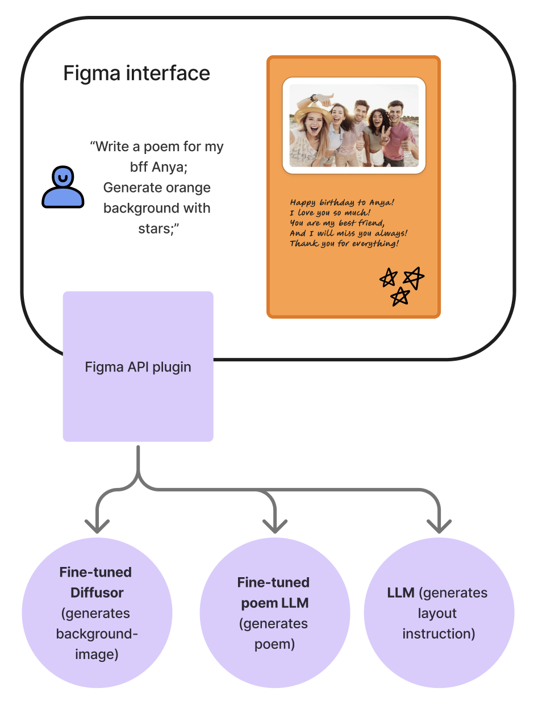
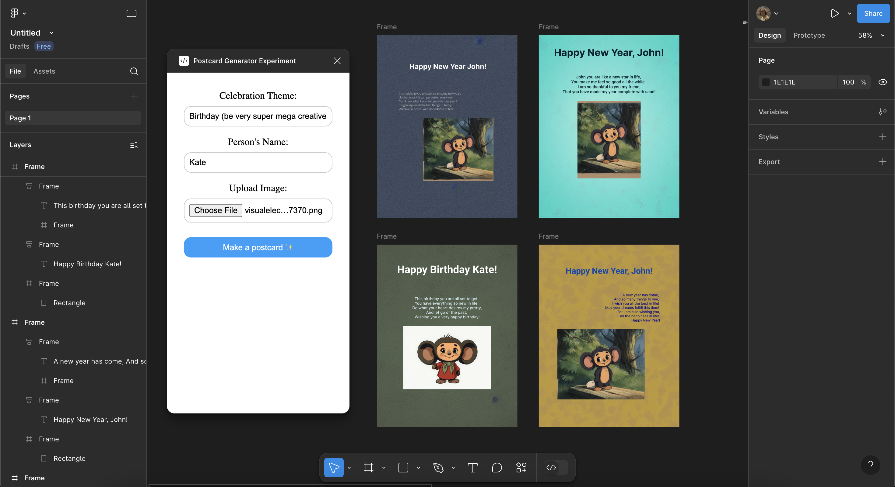

# AIGreetCraft: AI-Powered Greeting Card Generation

## Abstract

AIGreetCraft is a research project exploring the application of generative AI in creating personalized greeting cards. The system integrates a couple of AI components: a fine-tuned language model for poetry generation and a diffusion model for background creation - all within a Figma plugin interface. This project is developed as part of the GenAI course at Innopolis University.



## Project Overview

The system consists of three main components:

1. **Poem Generator**: A fine-tuned language model specialized occasion-specific poetry in Russian
2. **Background Generator**: A custom-trained diffusion model for thematic background generation
3. **Figma Layout Composer**: A plugin utilizing the Figma API for dynamic visual element arrangement



## Using the plugin

1. Visit the [Figma plugin page](https://www.figma.com/community/plugin/1479114006154342367/postcard-generator-experiment).
2. Click on "Use".
3. Follow the on-screen instructions to generate your greeting card



## Repository Structure

This repository is organized as a monorepo with the following components:

- `/src` - Core model training and implementation code
- `/modal` - Deployment configuration and code for [Modal platform](https://modal.com)
  - `/modal/poem-llm` - Serverless deployment of the poem generation model using Modal
  - `/modal/postcard-content` - Serverless deployment of content in the postcard
- `/figma-plugin` - Figma plugin implementation
- `/experiments` - Jupyter notebooks and experimental code

## [GitHub link](https://github.com/andrewlevada/postcard-generator-experiment/tree/main)

## How to Run Locally

### Python Environment Setup

1. Create and activate a virtual environment:

   ```bash
   python -m venv venv
   source venv/bin/activate  # On Windows: venv\Scripts\activate
   ```

2. Install dependencies:

   ```bash
   cd src
   pip install -r requirements.txt
   ```

3. Run the model:
   ```bash
   python poem_model.py
   ```

### Figma Plugin Development

1. Install Node.js dependencies:

   ```bash
   cd figma-plugin
   yarn install
   ```

2. Build the plugin:

   ```bash
   yarn build
   ```

3. Load the plugin in Figma:
   - Open Figma desktop app
   - Go to Plugins > Development > Import plugin from manifest
   - Select the `manifest.json` file from the `figma-plugin` directory

## Authors

- Nazgul Salikhova, Innopolis, n.salikhova@innopolis.university
- Natalia Agapova, Innopolis, n.agapova@innopolis.university
- Andrew Levada, Innopolis, a.levada@innopolis.university

## Acknowledgments

This project is developed as part of the GenAI course at Innopolis University.
